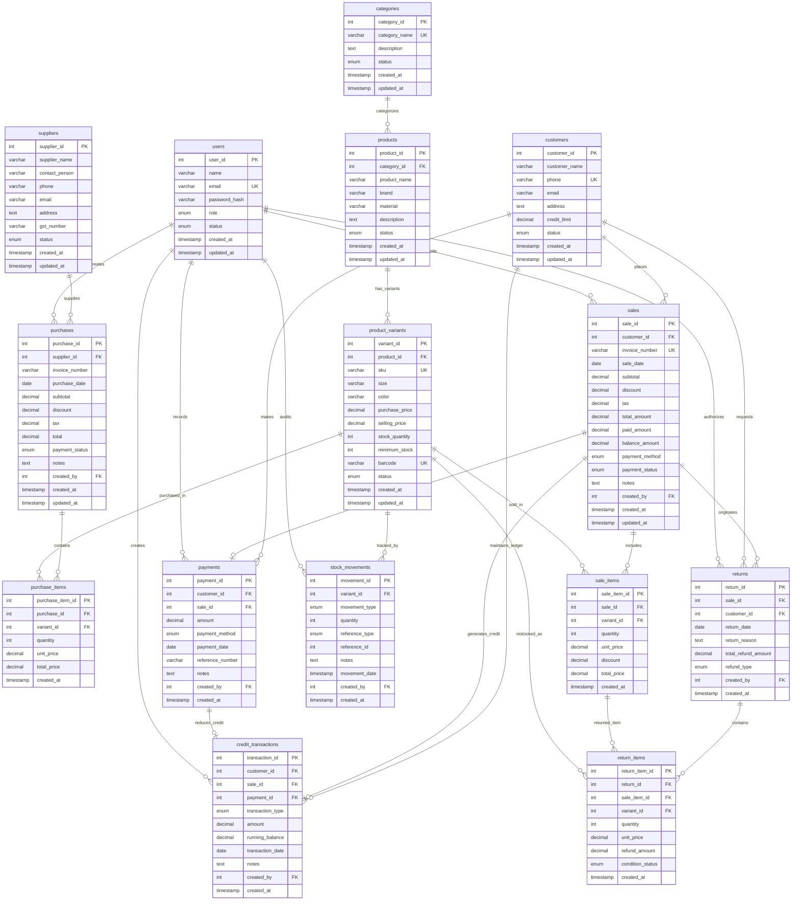

# Entity-Relationship Diagram (15 Tables)

## VL Silks - Full Database ER Diagram

Source: `database/schema.sql` (Verified)

```mermaid
erDiagram
    users {
        int user_id PK
        varchar name
        varchar email UK
        varchar password_hash
        enum role
        enum status
        timestamp created_at
        timestamp updated_at
    }

    categories {
        int category_id PK
        varchar category_name UK
        text description
        enum status
        timestamp created_at
        timestamp updated_at
    }

    products {
        int product_id PK
        int category_id FK
        varchar product_name
        varchar brand
        varchar material
        text description
        enum status
        timestamp created_at
        timestamp updated_at
    }

    product_variants {
        int variant_id PK
        int product_id FK
        varchar sku UK
        varchar size
        varchar color
        decimal purchase_price
        decimal selling_price
        int stock_quantity
        int minimum_stock
        varchar barcode UK
        enum status
        timestamp created_at
        timestamp updated_at
    }

    suppliers {
        int supplier_id PK
        varchar supplier_name
        varchar contact_person
        varchar phone
        varchar email
        text address
        varchar gst_number
        enum status
        timestamp created_at
        timestamp updated_at
    }

    purchases {
        int purchase_id PK
        int supplier_id FK
        varchar invoice_number
        date purchase_date
        decimal subtotal
        decimal discount
        decimal tax
        decimal total
        enum payment_status
        text notes
        int created_by FK
        timestamp created_at
        timestamp updated_at
    }

    purchase_items {
        int purchase_item_id PK
        int purchase_id FK
        int variant_id FK
        int quantity
        decimal unit_price
        decimal total_price
        timestamp created_at
    }

    customers {
        int customer_id PK
        varchar customer_name
        varchar phone UK
        varchar email
        text address
        decimal credit_limit
        enum status
        timestamp created_at
        timestamp updated_at
    }

    sales {
        int sale_id PK
        int customer_id FK
        varchar invoice_number UK
        date sale_date
        decimal subtotal
        decimal discount
        decimal tax
        decimal total_amount
        decimal paid_amount
        decimal balance_amount
        enum payment_method
        enum payment_status
        text notes
        int created_by FK
        timestamp created_at
        timestamp updated_at
    }

    sale_items {
        int sale_item_id PK
        int sale_id FK
        int variant_id FK
        int quantity
        decimal unit_price
        decimal discount
        decimal total_price
        timestamp created_at
    }

    payments {
        int payment_id PK
        int customer_id FK
        int sale_id FK
        decimal amount
        enum payment_method
        date payment_date
        varchar reference_number
        text notes
        int created_by FK
        timestamp created_at
    }

    credit_transactions {
        int transaction_id PK
        int customer_id FK
        int sale_id FK
        int payment_id FK
        enum transaction_type
        decimal amount
        decimal running_balance
        date transaction_date
        text notes
        int created_by FK
        timestamp created_at
    }

    stock_movements {
        int movement_id PK
        int variant_id FK
        enum movement_type
        int quantity
        enum reference_type
        int reference_id
        text notes
        timestamp movement_date
        int created_by FK
        timestamp created_at
    }

    returns {
        int return_id PK
        int sale_id FK
        int customer_id FK
        date return_date
        text return_reason
        decimal total_refund_amount
        enum refund_type
        int created_by FK
        timestamp created_at
    }

    return_items {
        int return_item_id PK
        int return_id FK
        int sale_item_id FK
        int variant_id FK
        int quantity
        decimal unit_price
        decimal refund_amount
        enum condition_status
        timestamp created_at
    }

    categories ||--o{ products : "categorizes"
    products ||--o{ product_variants : "has_variants"
    suppliers ||--o{ purchases : "supplies"
    purchases ||--o{ purchase_items : "contains"
    product_variants ||--o{ purchase_items : "purchased_in"
    customers ||--o{ sales : "places"
    sales ||--o{ sale_items : "includes"
    product_variants ||--o{ sale_items : "sold_in"
    customers ||--o{ payments : "makes"
    sales ||--o| payments : "settled_via"
    customers ||--o{ credit_transactions : "maintains_ledger"
    sales ||--o| credit_transactions : "generates_credit"
    payments ||--o| credit_transactions : "reduces_credit"
    product_variants ||--o{ stock_movements : "tracked_by"
    sales ||--o{ returns : "originates"
    customers ||--o{ returns : "requests"
    returns ||--o{ return_items : "contains"
    sale_items ||--o{ return_items : "returned_item"
    product_variants ||--o{ return_items : "restocked_as"
    users ||--o{ purchases : "creates"
    users ||--o{ sales : "bills"
    users ||--o{ payments : "records"
    users ||--o{ credit_transactions : "creates"
    users ||--o{ stock_movements : "audits"
    users ||--o{ returns : "authorizes"
```
